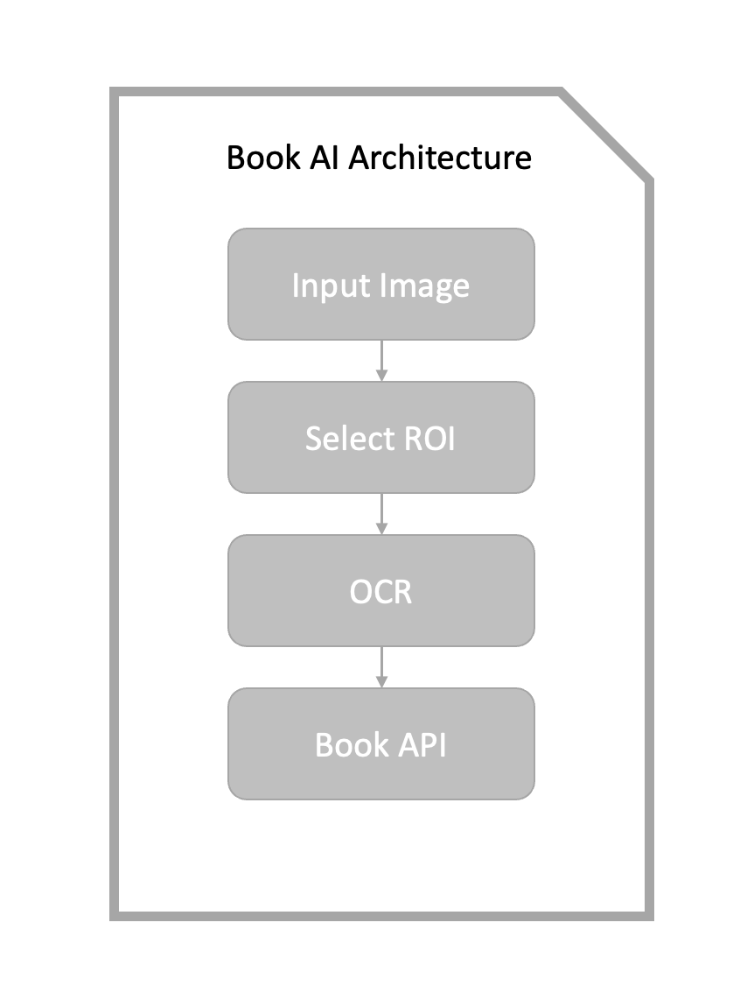

--- 
### Description 

this project aims to automatic search the information about a book using its cover image.

---
### Use Package 
1. tensorflow 
2. opencv

### Architecture

### Use deep learning Model 
1. VGG16
2. Moblie Net 
3. New model to added  

----
### What is ROI?

ROI stands for Region of interest By Creating such a region of interest, less computing power is required for image processing and the recognition rate can be increased.

---
### Why use OCR

OCR stands Optical Character Recognition. The reason for using OCR is that searching through OCR rather than searching for the book cover it self, makes it easier to search through the book search API 

